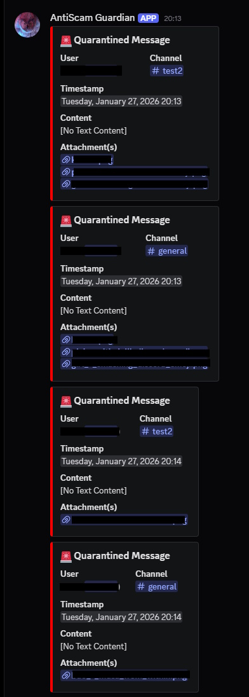

# AntiScam Guardian Bot

A Discord bot designed to protect your server from scam and spam messages.  
It automatically quarantines suspicious messages, restricts offending users, and logs incidents for moderation.

---

## Features

- Detects **repeated text or image messages** from users
- **Quarantines** the first and second occurrence
- **Applies a restricted role** to offenders
- Posts detailed **mod-log / quarantine messages** with:
  - User
  - Channel
  - Timestamp
  - Message content and/or attachments

---

## Setup

### 1️⃣ Create your bot application

1. Go to the [Discord Developer Portal](https://discord.com/developers/applications)
2. Create a new application → Bot → Add Bot
3. Enable **Message Content Intent** and **Server Members Intent**

---

### 2️⃣ Prepare your server

1. **Restricted role**: Create a role (name doesn’t matter)
   - Place it **above other roles**
   - Apply restrictions you want

2. **Optional channels**:
   - **Quarantine channel** – bot will post quarantined messages
   - **Mod-log channel** – bot logs spam activity
   - (Both currently give the same messages, so no need to use both)

---

### 3️⃣ Configure your bot

1. Rename `.env.example` → `.env`
2. Fill in the following:
   - `DISCORD_TOKEN` → your bot token
   - `QUARANTINE_CHANNEL_ID` → ID of your quarantine channel (optional)
   - `MOD_LOG_CHANNEL_ID` → ID of your mod-log channel (optional)
   - `RESTRICTED_ROLE_ID` → ID of your restricted role

---

### 4️⃣ Invite the bot

- OAuth2 → Scopes: `bot`
- Permissions: `Manage Messages`, `Manage Roles`, `View Channels`, `Send Messages`, `Read Message History`
- Invite to your server

---

### 5️⃣ Run locally

- Open your terminal in your project directory (VS Code, etc.)
- Run:

```bash
node src/index.js
```

- The bot should now be online and active on your server.

5. How It Works

- Any duplicate message sent by the same user within 5–10 minutes will be automatically removed.

- The restricted role is added to the user.

- A notification is sent to the Quarantine and/or Mod-log channel(s).


